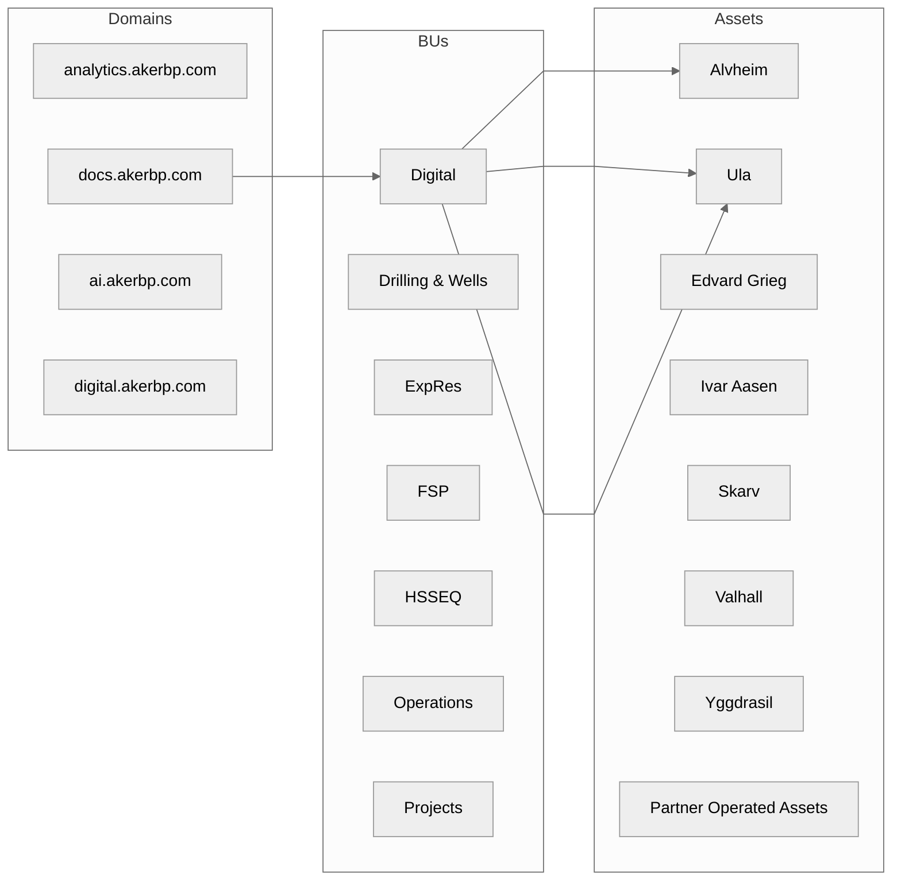
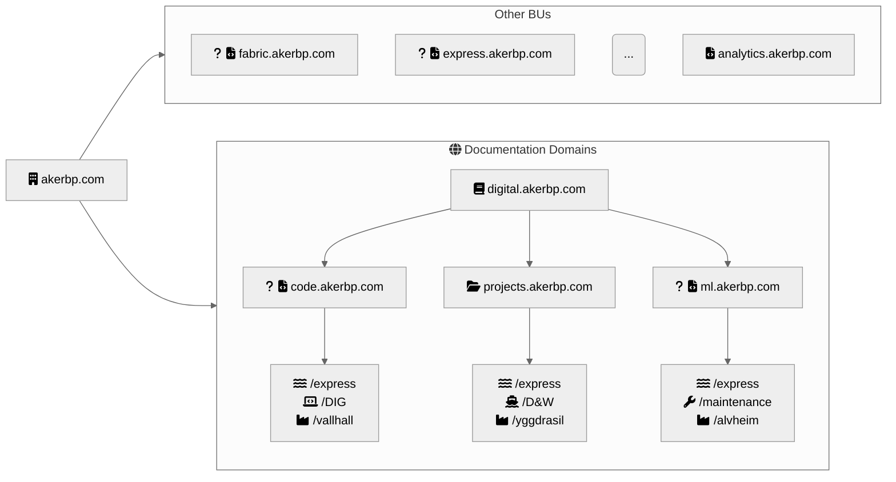

```mermaid
%%{init: {'theme': 'neutral', 'flowchart': { 'curve': 'linear' } } }%%
graph LR
    Digital[Digital] --> Alvheim
    Digital --> Ula

    DW[Drilling & Wells]
    ExpRes[ExpRes]
    Digital --> Ula
    FSP[FSP]
    HSSEQ[HSSEQ]
    Operations[Operations]
    Projects[Projects]
    
    Alvheim[Alvheim]
    EG[Edvard Grieg]
    IA[Ivar Aasen]
    Skarv[Skarv]
    Ula[Ula]
    Valhall[Valhall]
    Yggdrasil[Yggdrasil]
    OA[Partner Operated Assets]
    
    analytics[analytics.akerbp.com]
    docs[docs.akerbp.com] --> Digital
    ml[ai.akerbp.com]
    digital[digital.akerbp.com]

subgraph Assets
    Valhall
    Ula
    EG
    IA
    Alvheim
    Skarv
    Yggdrasil
    OA
end

subgraph BUs
    Digital
    DW
    ExpRes
    FSP
    HSSEQ
    Operations
    Projects
end

subgraph Domains
    digital
    docs
    analytics
    ml
end

```

---
---

```mermaid
%%{init: {'theme': 'neutral', 'flowchart' : { 'curve' : 'basis' } } }%%
graph LR
    akerbp[fa:fa-building akerbp.com ] --> Rest
    akerbp --> Doc
    digital[fas:fa-book digital.akerbp.com]
    fabric[fa:fa-question fa:fa-file-code fabric.akerbp.com]
    express[fa:fa-question fa:fa-file-code express.akerbp.com]
    digital --> code[fa:fa-question fa:fa-file-code code.akerbp.com]
    digital --> ml[fa:fa-question fa:fa-file-code ml.akerbp.com]
    digital --> projects[fa:fa-folder-open projects.akerbp.com]
    code --> codesubdomains[fa:fa-water /express<br> fa:fa-laptop-code /DIG <br>fa:fa-industry /vallhall]
    projects --> projectsubdomains[fa:fa-water /express<br> fa:fa-ship /D&W <br>fa:fa-industry /yggdrasil]
    ml --> mlsubdomains[fa:fa-water /express<br> fa:fa-wrench /maintenance <br>fa:fa-industry /alvheim]

subgraph Doc[fas:fa-globe Documentation Domains]
    digital
    ml
    code
    projects
    codesubdomains
    projectsubdomains
    mlsubdomains
end
subgraph Rest[Other BUs]
    B(...)
    analytics[fa:fa-file-code analytics.akerbp.com]
    fabric
    express
end


```
