!!! Note "«Requirements mapping»"

    Digital Well Planning / Pore Pressure and Fracture Gradient (PPFG) curves for use in Well Engineering, in the planning phase / DWP

!!! Warning "*Template usage*"

    *This template is used as a template for requirements specifications.
    Not all chapters need to be filled out, but the template should be seen
    as a checklist. We only fill out what is necessary and relevant.*

| Metadata                                                                                              |
| :---------------------------------------------------------------------------------------------------- |
| Author: Henrik Næsgaard / Data Product Support Team  Date: 2024.09.XX  Version: Draft 1.1 |

## Document Control (Mandatory)

### Template History

| **Who**              | **Revision** | **Date**   | **Comment**      |
| -------------------- | ------------ | ---------- | ---------------- |
| Alexander Tharaldsen | Final 1.0    | 29.05.2024 | Template created |

### Document History

| **Who**         | **Revision** | **Date**   | **Comment**                                                               |
| --------------- | ------------ | ---------- | ------------------------------------------------------------------------- |
| Henrik Næsgaard | Draft 0.0    | 10.06.2024 | Draft Version 0.0                                                         |
| Henrik Næsgaard | Draft 1.0    | 07.07.2024 | Draft Version 1.0 + attempted to adjust for new Template (Final 1.2)      |
| Frode Efteland  | Draft 1.1    | 12.11.2024 | Draft version 1.1. Comments and changes by the Data Product Support Team. |

### Action List

| **Who** | **Task** | **Comment** |
| ------- | -------- | ----------- |
|         |          |             |

### References

| **Description**                                                                      | **Link**                                                                                                                                              |
| ------------------------------------------------------------------------------------ | ----------------------------------------------------------------------------------------------------------------------------------------------------- |
| PPFG to EDM Solutioning by DWP team                                                  | https://miro.com/app/board/uXjVPlZxm5E=/                                                                                                              |
| Data Product Canvases for PPFG as used when applying Guideline to practical use case | https://miro.com/app/board/uXjVNeiYapo=/                                                                                                              |
| TR for PPFG Prediction                                                               | 51-001183 Guideline for pore-pressure fracture gradient prediction (PPFG) and well stability (WBS)                                                    |
| TR for PPFG Forecasting                                                              | 51-000566 Technical Requirements for Pore, Fracture and Collapse Pressure Forecasting                                                                 |
| PPFG Review template                                                                 | [51-001619 PPFG review template](https://akerbp.qualisoft.no/production/?oid=9ea2cf64-98e0-4253-943d-04d748d3a107)                                    |
| Latest IOGP Report                                                                   | IOGP Report 608 - Recommended practice for pore pressure and fracture gradient analysis for well design – construction, intervention, and abandonment |

## Purpose of the Project (Mandatory)

### Project Goals

#### Project goal(s): 

- Expose PPFG curves to WellMate (Necessary delivery for the Drilling
  Program for Yggdrasil by August 2024)

- Expose PPFG curves to DWP (Drilling Engineers in ABP for Well
  Engineering including Casing Design, Trajectory, Operational
  Parameters, BHA, Bit, Drilling Fluid, Cementing, Kick Tolerance,
  Integrity/Barrier tests, Detailed Drilling Procedures. In planning
  phase, this is represented by Digital Well Planning (DWP). ABP
  Christian Jacobsen is PO.)

- Expose PPFG curves to DWOS (Needed data to allow for any work to be
  performed in DWOS from training to engineering simulations; the bread
  and butter of the DWOS. Full application listing for engineering:
  WellPlanner, DrillExpect, DrillScene, WellPlan, DFG RTE.)

- Expose PPFG curves for the CWP session (for multidisciplinary
  visualisation)

- Expose PPFG curves to DWA (Necessary input for the Advisory systems
  for automation drilling)

- Expose PPFG curves to Sitecom WellAdvisor

- Expose PPFG curves to central repository for tracking of
  decision-making and for general availability of Data Products in
  AkerBP. This is proposed solved in FDP and ADME, but the
  benefit/cost/timeline of this sustainable integration, needs to be
  evaluated against quicker point-to-point implementations.

- Expose PPFG curves to Gravitas

#### Timeline: 

Successfully launching this project would generate significant value and
cost savings, particularly if it is completed before Q3 2024
(1st August 2024), when the Yggdrasil operation is scheduled
to commence.

### Background

There are several initiatives that need the PPFG data, but the one that
has the highest priority (from the point of view of Henrik Næsgaard) is
WellMate (the Digital Drilling Program). This initiative needs the PPFG
by August 2024. The importance of the WellMate delivery cannot be
restated in fullness here, but can be attempted summarized by
underlining that the Yggdrasil Team has stated that they will not be
able to create Drilling Programs in time due to insufficient resources,
unless a digital solution is presented that can automate some of the
workflow. The transfer of subsurface data (including PPFG) is in scope
for this.

Since automation by August 2024 was not reached, the WellMate team has
bought some time by gaining priority with the DWP team for a manual
Excel import of the required curves for Well Engineering according to
BMS. This solution is only temporary, a more automated dataflow MUST be
instated. The required curves are listed below.

- Pore Pressure (PP) P5-10

- Pore Pressure Expected

- Pore Pressure High P95-99

- Fracture Gradient (FG) P5-10

- Fracture Gradient Expected

- Fracture Gradient P95-99

- Minimum Horizontal Stress (Shmin) P5-10

- Minimum Horizontal Stress (Shmin) Expected

- Minimum Horizontal Stress (Shmin) P95-99

- Collapse Gradient (CG) Expected

- Overburden Gradient (OBG) Expected

Below is presented a typical PPFG plot as completed in Gravitas for the
Drilling Program, for visualisation (format: pdf snippet).

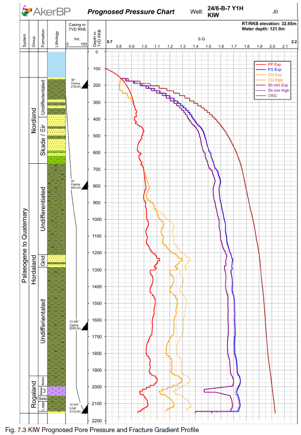

It is also the belief of the WellMate team that pulling the PPFG data
from EDM/DWP makes sense from the perspective that the Drilling Program
should summarize the data that was used for the Well Design (which is
carried out in EDM/DWP). Combined with a general desire to expose data
to all, the team hopes that a solution for exposing data to EDM can be
extended to any other subscriber.

From an operational safety perspective, it is an absolute necessity to
expose and govern this data as input for Well Engineering. A few
examples (among thousands) for usage areas are casing loads, operational
window during drilling, selection of drilling tools, trajectory
optimization, etc... These data form the decision input package for the
well design and operational planning. If erroneous, it could lead to
operational events such as kicks and losses. Conversely, better data
quality can green-light less over-designed wells, reducing cost. The
correct implementation strategy will result in mitigating barriers
against poor engineering, reduce risk, duplication of data resulting in
ungoverned data, etc...

### Business case 

Although not defined as "safety critical", PPFG should be defined as
such, as the highest impact outcome could be a blowout with loss of
life. One level lower of impact, we find the cost implications of long
operational delays due to losses, kicks and wellbore instability. On a
lower level of impact, we find costs incurred through poorly coordinated
well designs. Reduction in downhole operational events of 3% across
assets over 2 years. Reduction of capex cost of well design reduced by
5% across assets over 3 years.

## Stakeholders (Optional)

**Main stakeholder**

<table>
<colgroup>
<col style="width: 33%" />
<col style="width: 33%" />
<col style="width: 33%" />
</colgroup>
<thead>
<tr>
<th rowspan="3">
<strong>[NAME] the
&lt;CHARACTERISTIC&gt;</strong>

Drilling Engineer Henrik, Member of Yggdrasil Well Engineering
Team.

36 years young and well-built (athletic). Many more positives too
list, but space is limited. Extremely humble.

“I have done well designs several times before and know of the
tedious process”

“I value quick iterations for more sensitivities for more accurate
engineering. I despise governance issues and spending unnecessary time
on coordination”
</th>
<th>
<strong>Routines</strong> (to pinpoint challenges)

<em>[Henrik] needs to</em>

<ul>
<li>
Update the trajectory in EDM as a result of T&amp;D
engineering
</li>
<li>
Inform Operational Geologist that I have made changes and
convince that time is well spent, gathering a new set of input
data
</li>
<li>
X days later the new data is prepared. Process and lineage
unknown.
</li>
<li>
I am given a link to Sharepoint or sent the PPFG on
email
</li>
<li>
I receive different PPFG for different Assets/employees. I call
OpsGeo to ask which data from the Excel sheet that I should use
</li>
<li>
I import a maximum of 2 curves into DWP. It is an annoying
process that is prone to failure (maximum ~450 points, randomly
unstable, poor UX)
</li>
<li>
I complete my engineering based on 2 curves selected. For more
sensitives, I need to repeat the work done in DWP.
</li>
<li>
Drilling Program is ready to be completed, I ask the OpsGeo for a
low-quality, non-interactive snippet from Gravitas that the offshore
team will use to make decisions.
</li>
</ul></th>
<th>
<strong>Wishes he has</strong>

<em>The wishes should be prioritized:</em>

<ol type="1">
<li>
Remove redundant manual work. Update PPFG only one place
(duplication)
</li>
<li>
Make sure I am using the correct PPFG (governance)
</li>
<li>
Ensure the correct PPFG is exposed to interested initiatives
(exposure)
</li>
<li>
Understand the maturity of the data, understand where it comes
from, understand how I should use it (lineage)
</li>
</ol></th>
</tr>
<tr>
<th>
<strong>Goals</strong>

<ul>
<li>
Conduct Well Engineering tasks to increase safety and robustness
of design
</li>
<li>
Reduce cost to ALARP
</li>
<li>
Complete necessary deliverables such as Drilling
Programs
</li>
</ul></th>
<th>
<strong>Tools</strong>

<em>Everyday, Henrik uses ….</em>

<ul>
<li>
DWP/EDM
</li>
<li>
Powerpoint, Excel, Sharepoint
</li>
</ul>

<em>Sometimes, [he] uses…..</em>

<ul>
<li>
N/A
</li>
</ul></th>
</tr>
<tr>
<th colspan="2">
<strong>Person does not need:</strong>

<ul>
<li>
Unproductive, brainless work
</li>
<li>
Time-wasters
</li>
</ul></th>
</tr>
</thead>
<tbody>
</tbody>
</table>

**Other key Stakeholders**

<table>
<colgroup>
<col style="width: 32%" />
<col style="width: 67%" />
</colgroup>
<thead>
<tr>
<th>stakeholder</th>
<th>Needs</th>
</tr>
</thead>
<tbody>
<tr>
<td>
Customer (Asset/BU/Dept)

Drilling Engineers

Completion Engineers

Lead Engineers

Asset Leads
</td>
<td>
Needs the Well Design data.

Needs the Well Design data.

Accountable for Well Design (cost/HSE, etc..)

Accountable for Well Design (cost/HSE, etc..)
</td>
</tr>
<tr>
<td>Customer's Customer (VSM/User)</td>
<td></td>
</tr>
<tr>
<td>
Other Stakeholders

Rock Mechanics

Subsurface

EXPRES

Geology

Geophysicist
</td>
<td>
Owner of the Data

Provides input to Data

Provides input to Data

Provides input to Data

Provides input to Data
</td>
</tr>
<tr>
<td>
Personas

PPFG user

PPFG provider
</td>
<td>
Subscriber/consumer

Creator/owner
</td>
</tr>
</tbody>
</table>

## Terms and Definitions (Mandatory)

<table>
<colgroup>
<col style="width: 19%" />
<col style="width: 80%" />
</colgroup>
<thead>
<tr>
<th>Term</th>
<th>description</th>
</tr>
</thead>
<tbody>
<tr>
<td>ABP</td>
<td>AkerBP (Company)</td>
</tr>
<tr>
<td>ALARP</td>
<td>As Low As Reasonably Practicable</td>
</tr>
<tr>
<td>API</td>
<td>Application Programmable Interface</td>
</tr>
<tr>
<td>AS RUN</td>
<td>Status when completed after Execution (aka Post-Drill or
Actual)</td>
</tr>
<tr>
<td>Backbone</td>
<td>Database solution provided by Keystone</td>
</tr>
<tr>
<td>BEST</td>
<td>Terminology applied to subsurface curves for the “latest and
greatest”</td>
</tr>
<tr>
<td>BHA</td>
<td>BottomHole Assembly (equipment)</td>
</tr>
<tr>
<td>BMS</td>
<td>Business Management System</td>
</tr>
<tr>
<td>BOWK</td>
<td>BlowOut and Well Kill (module in DWP)</td>
</tr>
<tr>
<td>BU</td>
<td>Business Unit (organisational department)</td>
</tr>
<tr>
<td>CG</td>
<td>Collapse Gradient (aka Wellbore Stability WBS curve)</td>
</tr>
<tr>
<td>COMPASS</td>
<td>Application for Directional Planning by Halliburton</td>
</tr>
<tr>
<td>Csv</td>
<td>File format</td>
</tr>
<tr>
<td>CWP</td>
<td>Collaborative Well Planning (process)</td>
</tr>
<tr>
<td>DG</td>
<td>Decision Gate (process milestone)</td>
</tr>
<tr>
<td>DFG RTE</td>
<td>Halliburton software for real-time Fluids/Hydraulics</td>
</tr>
<tr>
<td>DSG</td>
<td>DecisionSpace Geosciences application by Halliburton</td>
</tr>
<tr>
<td>DSIS</td>
<td>Data transfer solution (Halliburton systems)</td>
</tr>
<tr>
<td>DWA</td>
<td>DWA: Digital Well Automation, platform installed on-site for sharing
of data and drilling advisory.</td>
</tr>
<tr>
<td>DWOS</td>
<td>DWOS: Drilling Well On Simulator, Simulator training and Engineering
Simulations in the ABP OCC (Onshore Collaboration Center).</td>
</tr>
<tr>
<td>DWP</td>
<td>DWP: Digital Well Program, Halliburton software for Well
Engineering.</td>
</tr>
<tr>
<td>DWX</td>
<td>Digital Well eXchange. Data transfer method by Halliburton
(Kafka)</td>
</tr>
<tr>
<td>EDM</td>
<td>Engineering Data Model. Database for DWP.</td>
</tr>
<tr>
<td>EXPRES SME</td>
<td>EXPlorationREServoir Subject Matter Expert</td>
</tr>
<tr>
<td>FA</td>
<td>Friction Angle (Rock Mechanics curve)</td>
</tr>
<tr>
<td>FDP</td>
<td>Field Development Plan. Application for Asset Management by
Halliburton</td>
</tr>
<tr>
<td>Execution</td>
<td>Project state for D&amp;W, equivalent to DG3-WG2, during drilling of
the Well.</td>
</tr>
<tr>
<td>HSE</td>
<td>Health, Security and Environment</td>
</tr>
<tr>
<td>ID</td>
<td>Identifier</td>
</tr>
<tr>
<td>IDOS</td>
<td>IDOS: integrated Design of Service, Halliburton software for
managing Service Company Engineering deliverables.</td>
</tr>
<tr>
<td>IOGP</td>
<td>International Association of Oil &amp; Gas Producers</td>
</tr>
<tr>
<td>KIND</td>
<td>Term used in OSDU Standard for the Schema name and version.</td>
</tr>
<tr>
<td>LAS</td>
<td>File format</td>
</tr>
<tr>
<td>MSL</td>
<td>Mean Sea Level. Often used as datum for Well Operations.</td>
</tr>
<tr>
<td>OBG</td>
<td>Overburden Gradient (Rock Mechanics curve)</td>
</tr>
<tr>
<td>OpsGeo</td>
<td>Operational Geologist (role)</td>
</tr>
<tr>
<td>OSDU</td>
<td>OSDU: data platform for Energy companies</td>
</tr>
<tr>
<td>OW</td>
<td>OpenWorks software by Halliburton</td>
</tr>
<tr>
<td>Petrel</td>
<td>Software by Schlumberger</td>
</tr>
<tr>
<td>Petrel Studio</td>
<td>Software by Schlumberger</td>
</tr>
<tr>
<td>Planning Phase</td>
<td>Period extending from pre-DG0 to DG3-WG2 (start of Execution).</td>
</tr>
<tr>
<td>PO</td>
<td>Project Owner (role)</td>
</tr>
<tr>
<td>Post-Drill</td>
<td>State after completion of relevant operational step in Execution
(aka AS RUN or Actual)</td>
</tr>
<tr>
<td>PostGres</td>
<td>PostGreSQL Database system</td>
</tr>
<tr>
<td>PPFG</td>
<td>
PPFG (Pore Pressure and Fracture Gradient): Curves indicating the
pressure in the formation pores and the strength of the rock. In
practice, these are used as minimum and maximum energy limits to apply
to the hole being drilled.

OSDU PPFG def: _Pore Pressure and Fracture (Pressure) Gradient (PPFG)
data describes the predicted (Pre-drill) and actual (Post-drill)
depth-related variations in overburden stress, pore pressure, fracture
pressure and minimum principal stress within a wellbore and conveys the
range of uncertainty in these values given various plausible geological
scenarios. PPFG predictions are fundamental inputs for well design and
construction and estimates of pore and fracture pressure are typically
provided to the well planning and execution teams.
</td>
</tr>
<tr>
<td>Pre-Drill</td>
<td>State prior to operational Execution, hence estimations and
predictions from the Planning Phase.</td>
</tr>
<tr>
<td>PVT</td>
<td>Pressure, Volume and Temperature. Dataset giving characteristics of
an object under variations of these three parameters.</td>
</tr>
<tr>
<td>QAQC</td>
<td>Quality Control and Quality Assurance</td>
</tr>
<tr>
<td>Record</td>
<td>A populated schema</td>
</tr>
<tr>
<td>RM</td>
<td>Rock Mechanics (AkerBP Business Unit. Owners of PPFG)</td>
</tr>
<tr>
<td>ROCQ</td>
<td>Company providing data transfer solutions</td>
</tr>
<tr>
<td>Schema</td>
<td>Structure of datafile. Not a Record.</td>
</tr>
<tr>
<td>SCWA</td>
<td>SCWA: SiteCom WellAdvisor</td>
</tr>
<tr>
<td>Shmin</td>
<td>Minimum Horizontal Stress (Rock Mechanics curve)</td>
</tr>
<tr>
<td>Snapshot</td>
<td>Captured copy of record at the time of snapshot trigger</td>
</tr>
<tr>
<td>Stresscheck</td>
<td>Application for casing design by Halliburton</td>
</tr>
<tr>
<td>TR</td>
<td>Technical Requirement</td>
</tr>
<tr>
<td>Trajectory Loop</td>
<td>Abstraction of the non-existing digital process of looping the
trajectory between Subsurface and Drilling BUs, while attaching updated
datasets (including PPFG)</td>
</tr>
<tr>
<td>TVD</td>
<td>Terminal Vertical Depth (or Total/True Vertical Depth)</td>
</tr>
<tr>
<td>UCS</td>
<td>Unconfined Compressive Stress (Rock Mechanics curve)</td>
</tr>
<tr>
<td>UX</td>
<td>User eXperience (design term)</td>
</tr>
<tr>
<td>WBS</td>
<td>Wellbore Stability (aka Collapse Gradient. Rock Mechanics
curve)</td>
</tr>
<tr>
<td>WellMate</td>
<td>Digital Drilling Program: Software that pulls information from
different source to auto-generate the Drilling Program.</td>
</tr>
<tr>
<td>WITSML</td>
<td>Wellsite Information Transfer Standard Markup Language (data
exchange standard)</td>
</tr>
<tr>
<td>WKS</td>
<td>WKS: Well Known Schemas; current approved schemas of the OSDU
standard</td>
</tr>
</tbody>
</table>

## Relevant Facts and Assumptions (Optional)

### Relevant Facts

### Assumptions

| Assumption                                                                                                                                                                                                                                                    | Project Phase | Status | Replaced by Requirement |
| ------------------------------------------------------------------------------------------------------------------------------------------------------------------------------------------------------------------------------------------------------------- | ------------- | ------ | ----------------------- |
| PPFG needs to be locked to a Well Design_ID (trajectory).                                                                                                                                                                                                     | N/A           | N/A    | N/A                     |
| Can come through CWP session or from Petrel. The mechanism is not really important to the Drilling Team; as long as it is defined and supported by the Subsurface team.                                                                                       | N/A           | N/A    | N/A                     |
| Will be governed in FDP, stored on OSDU. DWX as transfer mechanism.                                                                                                                                                                                           | N/A           | N/A    | N/A                     |
| Keep only at PPFG for now (do not include Picks and other Geomechanical curves such as UCS and FA).                                                                                                                                                           | N/A           | N/A    | N/A                     |
| The assumption must be made that the updates are pushed from Petrel Studio (for simplicity).                                                                                                                                                                  | N/A           | N/A    | N/A                     |
| The assumption must be made that the updated PPFG curves are stored in PostGres when the destination is DWP/EDM (to not disrupt EDM engineering or crash EDM).                                                                                                | N/A           | N/A    | N/A                     |
| If we build a system with no notification system, there should be some human-relatable attribute to the flow such that we can verify through something simple like the name. (to build trust. Hence retain the name across applications.)                     | N/A           | N/A    | N/A                     |
| A microservice will be needed for coordinate system Conversion, when sharing across applications.                                                                                                                                                             | N/A           | N/A    | N/A                     |
| Collapse Gradient is calculated based on microservice that uses PP as input.                                                                                                                                                                                  | N/A           | N/A    | N/A                     |
| Petrel understands Well/Wellbore hierarchy.                                                                                                                                                                                                                   | N/A           | N/A    | N/A                     |
| Exchange of data is done at Wellbore level, not Well level.                                                                                                                                                                                                   | N/A           | N/A    | N/A                     |
| Explicitly, this request is for planning PPFG only. Not execution or AS RUN PPFG.                                                                                                                                                                             | N/A           | N/A    | N/A                     |
| Petrel Studio will not propose new trajectories.                                                                                                                                                                                                              | N/A           | N/A    | N/A                     |
| DWP will not propose new PPFG, WBS or Formations.                                                                                                                                                                                                             | N/A           | N/A    | N/A                     |
| It is NOT possible to retain the trajectory_ID upon copying designs in DWP (EDM).                                                                                                                                                                             | N/A           | N/A    | N/A                     |
| It is very challenging to retain Design_ID (or the ID of the EDM trajectory: definitive_survey_header_id) across the trajectory loop Petrel Studio-\>CWP-\>EDM-\>Petrel Studio.                                                                               | N/A           | N/A    | N/A                     |
| Should strive to have an open API for ingestion of PPFG for DWP (better for R&D -\> more urgency and buy-in). Avoid ABP-customized solution!                                                                                                                  | N/A           | N/A    | N/A                     |
| Petrel Studio user can observe desynchronization against DWP trajectories.                                                                                                                                                                                    | N/A           | N/A    | N/A                     |
| There is no way for the Petrel user to know if the trajectory has had minor changes since last pull. This is NOT covered by ROCQ governance.                                                                                                                  | N/A           | N/A    | N/A                     |
| From an Operational standpoint, it would be advisable to have the curves separated by Overburden/Reservoir. The process to create the Reservoir curves is usually more complex due to its criticality (this sentence to be confirmed/reviewed by EXPRES SME). | N/A           | N/A    | N/A                     |

## Scope of Work (Optional)

### Current Situation

- Excel import in EDM

- Limited to 2 curves

- No governance

### Work Context

In context with Well Design BMS.

### MVP scope

- Deliver Yggdrasil PPFG data from Delfi in a consumable format for DWP.

- The format should be OSDU ready.

## Functional Requirements (Mandatory)

\| \*\*Requirement ID\*\* \| \*\*Requirement Name\*\* \|
\*\*Description\*\* \| \*\*Priority\*\* \| \*\*Source\*\* \|
\*\*Acceptance Criteria\*\* \| \*\*Use Case/Scenario\*\* \|
\*\*Actors/User Roles\*\* \| \*\*Dependencies\*\* \| \*\*Non-functional
Attributes\*\* \| \*\*Assumptions\*\* \| \*\*Comments/Notes\*\* \|

Guidelines for Data Products, apply the following best practices:

1.  Identify and prioritize candidates for the Data Product approach, to
    ensure best possible use of resources and reduce risk.

2.  Design a new Data Product as a minimum viable product to ensure
    early usage and value outtake.

3.  Ensure that the data is produced according to the Data Product
    design, and verify and validate its consistency before sharing.

4.  Before making the Data Product ensure that it is fit for the purpose
    you want to apply it for.

##### Schema and Semantics, Lineage

- See chapter on Schema in “Ideas for solutions” (Proposed schema)

- PPFG includes a reference to a trajectory, Wellbore and Well

- PPFG schema should be as OSDU WKS compliant as possible.

- PPFG schema should detail which model was used, author, date created
  and typical metadata (lineage).

- PPFG should be made on communicated assumptions (assumptions described
  by Owner in the record or defined as part of Data Product description
  in Catalogue or addressed by standardized input workflow or otherwise
  communicated to consumers)

- From an Operational standpoint, it would be necessary to have the
  curves by wellbore.

- From an Operational standpoint, it would be advisable to have the
  curves separated by Overburden/Reservoir. The process to create the
  Reservoir curves is usually more complex due to its criticality (this
  sentence to be confirmed/reviewed by EXPRES SME). For the Final Well
  Report Section A - Geology we usually log the Overburden separately
  from the Reservoir (including for PPFG reporting).

- “BEST-curves” is the terminology used in ABP for the best curves
  available at any point in time. Correct terminology and classification
  to be done in schema.

- The PPFG curves should ideally be made available as a range (min, exp,
  max or their P10, P50 and P90 equivalents).

- “Min/exp/max” curve is a “Drilling Engineer term”. Subsurface team
  relates differently to the uncertainty of geomechanical curves.
  Correct terminology and classification to be done in schema.

- Datum assignment. As per the schema. Probably the PPFG (from OpenWorks
  or Petrel) needs to be on a standard datum, where MSL is the system
  default in EDM.

- The ‘PPFG forecast’ shall capture the expected pore and fracture
  gradient and its range of uncertainty as function of depth. The output
  from Petrel/Delfi, shall follow the technical requirement specified in
  D2 51-000566. Additional technical detail can be found in document
  51-001183: Guideline for porepressure fracture gradient prediction
  (PPFG) and well stability (WBS)

  - Need to update this document if it changes ExpRes workflow. See
    section 8.1 Digital Archives.

##### Architecture, validations

- PPFG validation microservice should validate the schema wrt to
  Business Rules

- PPFG transactions should be logged in FDP for in-depth analytics of
  the Well Design process, store decisions and to take up dormant
  projects at a later date.

- PPFG should not be copied multiple times into several consumer
  applications and use cases, using conventional means/manual work

- PPFG should be exposed to other initiatives than DWP (DWA, IDOS, CWP,
  DWOS, WellMate, SCWA).

- DSIS query towards OW needs to have a delimiter on Design_ID.
  Trajectory_ID limitation is also nice-to-have. The assumption is that
  a "significant enough change" triggers a copy of the EDM design with a
  renaming of the design (entirely manual process). The name change
  would be something along the lines of "30/11-F-2 A_Rev B0" to
  "30/11-F-2 A_Rev C0". The copy of the design would generate new IDs
  for the design and all data attached to it (including
  def_survey_header_ID). This means the lineage and versioning of the
  trajectory and design (and everything else) is not maintained
  adequately regardless. This in turn, means that it is not required to
  send over both Design_ID and Trajectory_ID, where Design_ID is
  sufficient. We can do it from an additional QAQC standpoint and with
  the future in mind. Question: can we retain these IDs throughout the
  loop EDM-\>Petrel Studio-\>OW-\>Petrel Studio?

##### Governance and versioning, Ownership

- Digital logging and storage of PPFG should be iterative and
  Decision-Gate-Less

- Versioning of the PPFG is imperative

- Solution needs to map out whether there is a requirement from Drilling
  Engineers on whether to not trigger a PPFG update. In other words, is
  it worthwhile to define “a big enough change” to require a new PPFG
  iteration? Do they want a choice for: “A change in the trajectory has
  been detected, do you want to trigger an iteration now?”. What does
  “updated/changed mean”? Assume it is “a big enough change” that would
  trigger a Design copy in EDM and a new Design with new trajectory
  name.

- Unless we snapshot the Trajectory on export from DWP, how can we
  rightfully import PPFG based on trajectory_ID? The trajectory may have
  been changed. Only barrier is a forced copy of design and store in EDM
  for every significant change ("significant change is when you should
  request PPFG update; minor change should not trigger new loop and is
  hence acceptable). Every major change should then force a new design
  with a new trajectory (and trajectory_ID). Every request to Petrel
  should then be a consequence of a major change (and new design,
  trajectory and trajectory_ID in EDM). This means that trajectory_ID is
  ONLY useful for the DWP PostGres import locked to Trajectory_ID. This
  workflow is very demanding for the users and riddled with pitfalls.

- The solution needs to be reviewed by Rock Mechanics. “We do need to
  assure the data owners in rock Mech that the data used is "theirs" -
  this is critical to get trust.”. “We need a clear path for verified,
  recognizable data from the source model (petrel) to the targets
  needing it.”. “The Rock Mech engineers are not your typical petrel
  user - we will need to make sure they are on board.” We need the
  proposed workflow to be verified by Rock Mechanics team

  - What are the issues we are aware off?

  - What is their workflow?

  - Address these issues in our proposal before engaging the Rock
    Mechanics Team

- The solutioning of the PPFG data exposure has shown to require
  standardization in the workflow within Petrel to ensure that we get
  consistent input. This is being worked on by Pete Heavey.

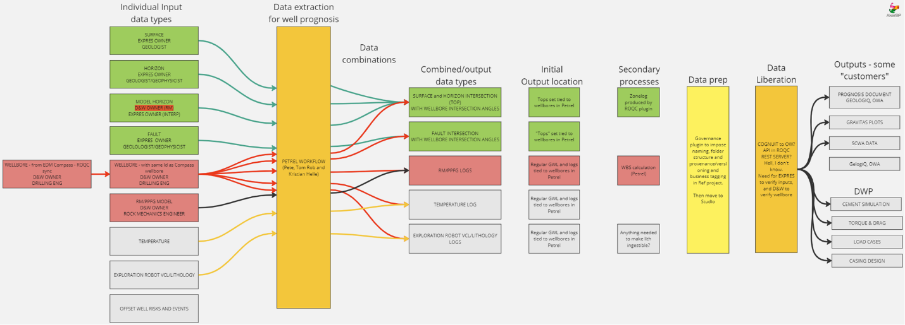

##### Security

- Access control should be managed

- A notification system is necessary due to potential impact of
  erroneous information on Well Design.

##### Related Initiatives: DWP

- See Chapter “Related Initiatives” in Ideas For Solution for
  dependencies (Related initiatives).

- Detection/Notification of desynchronization. DWP User to be notified
  that a change has happened on trajectory and that the geological data
  might be outdated, and then have the ability to request new data. OR
  in the perfect world with automation, as soon as a change has occurred
  user automatically passes the trajectory to get data updated. Note: If
  user duplicates a full design, and modifies PPFG, DWP will recalculate
  everything based on this change using the old data, this means there
  can be a risk at users do not update the data.

  - First version: Just a notification in DWP. Could be a text string on
    the component itself, “Have you updated your trajectory in Compass?
    Do you need new geo data? Click here”

- Trigger for new trajectory loop. Is it required to have a trigger for
  the Drilling Engineer to ask for a PPFG update or is the current
  Petrel Governance tool sufficient?

  - We need a PPFG request button in DWP. First version, when the user
    thinks it is a big enough change to trigger a new data request from
    subsurface. Assumed any change is resulting in a new design in EDM
    as per process in EDM to day (minor or major change, a new design is
    always made)

  - Ability to request update on data package if a trajectory has been
    changed/updated. Challenges: is this a button outside of DWP?

- Lock DWP Design while trajectory loop is in progress/updating. When
  new PPFG data is requested, how do we stop engineers from modifying
  the trajectory in the middle of waiting for the updated data?
  Especially in a semi-automatic world. Can we lock design until data
  has been made available and user "imports" this data to the design?
  Consider linking this to “significant change”, since a significant
  change in trajectory is the only likely trigger.

  - I need to understand why this would be needed. Also, pending
    solutioning, there could be no "requests for new PPFG"; they are
    just made as a result of monitoring for new trajectory updates (well
    name and "synced?"-checkbox in Petrel).

  - When new data is requested, how to we stop engineers to modify the
    trajectory in the middle of waiting for the updated data? Especially
    in a semi-automatic world. Can we lock design until data has been
    made available and user "imports" this data to the design?

- Notification of new PPFG available. A DWP notification that the PPFG
  data has been received would be nice. Who has sent the data should
  also be available. One solution is to pull the date from OW, from
  which the logical deduction is that we need a notification system in
  DWP on new PPFG available in OW.

- Limiting import choices to correct trajectory only. When importing
  PPFG data, DWP user should ONLY be able to select the relevant data.
  The problem today is that users can go into ANY project and select ANY
  well to import data, disregarding what design they are actually
  working on. Can we re-use the interface we have (OpenWorks import),
  but selection is filtered down to only relevant project in DSG? This
  probably demands that the trajectory_ID is maintained. Other solutions
  just slightly limit the number of wrong choices.

- Drilling Engineer requires to see the correct Design name (or some
  other recognizable metric) when pulling the data from OW. How can that
  person confirm visually (non-data technical), that what is being done
  is correct?

  - DWP requirement: The user must see Design_Name for import, even
    though the requirement/filter is by the def_survey_header_ID
    ("trajectory_ID").

- Prevent changes/alterations of subsurface data in DWP. Should not be
  possible to edit PPFG data in DWP. If engineers want to make a
  separate version for any sensitivities, they should do so by creating
  a separate version, and this version should also be clearly marked as
  “not original”.

- Insufficient resources. Need to review solution in DWP team for
  re-allocation of resources.

- Can we in DWP rename to "Pull from External source" for the Subsurface
  Essentials? Even though the OpenWorks connection should be an easy
  sell, it would be good to aim for something generic (both from DPW R&D
  Cores point of view and in view of our midterm goal of pulling from
  OSDU).

- Strong dependency on naming convention, since other EDM copies of the
  design are made for, among others, Sensitivity analysis

  - There needs to be a common understanding that updates to trajectory
    are made by adequately copying the EDM design and strictly adhering
    to the naming convention. Then, the Petrel user needs to monitor, on
    his own accord, for updates to trajectory. They will need to
    identify by naming convention what necessitates a new PPFG. They
    need to make the decision, on their own accord, to push a new
    updated PPFG. The DWP user needs to, on his own accord, query the OW
    database until the update appears and grab the update.

  - Sensitivities: Casing design, Torque and drag, Hydraulics, Casing
    setting depths, Reservoir lengths, BHA design, Fluid design

- We are allowing both pull from OW and manual upload, hence the loop
  WILL be broken. This is acceptable as long as the manual upload is
  seen as an informed decision to amend the data (short time during
  execution). The problem is that this will not be captured by non-DWP
  users; they will need to be comfortable with what is in OW. This is
  tolerable in the short-term.

##### Related Initiatives: WellMate (Digital Drilling Program)

- See Chapter “Related Initiatives” in Ideas For Solution for
  dependencies (Related initiatives).

- Requirement from WellMate: The data needs to be exposed in a way that
  works for InformatiQ.

  - It is assumed that a solution that works for DWP and InformatiQ,
    works for anyone. DWA, IDOS and DWOS are interested parties.

  - (re-use of the limiters in the DSIS query)

##### Related Initiatives: CWP

- What is the connection with CWP FDP team? What is the delta to make
  this workflow "FDP-compliant"? Does it make sense to pursue it?

  - As far as I know the CWP FDP process transfers Targets and
    Trajectory currently to EDM. How much work is it to expand this with
    PPFG? If it takes 1 month more with this solution as it connects to
    FDP, it is worth to do beyond any doubt.

- What is the difference in technical solution between transferring
  trajectory and transferring PPFG, WBS and formations? In other words,
  when we have a working trajectory loop, adding more data to the loop
  is "just" a matter of expanding the exposure capability and building
  out import workflows (this is up to each department).

### Maturity/workflows and Lineage

*If not covered above, the requestor will answer these specific
questions:*

- When do you need the Data Product with regards to maturity? (always
  latest? Only the version signed in FDP for Decision Gate 3 pass?
  Whenever Drilling Engineer makes an update in Execution?)

  - Answer: There should be loop for the trajectory, where a defined
    subsurface data package updates as a result of the trajectory
    change. Hence, at any stage a change in trajectory is submitted.

<!-- -->

- What do you need to know in order to trust the data you receive? (What
  parameters do you need in the schema? Do you need to know what model
  was used? Do you need to know the author? Do you know how to use the
  range of data you are receiving; which in the dataset should you use?)

  - Answer: Yes, I need all this information in the schema.

## Non-functional Requirements (Mandatory)

General design guidelines for non-functional requirements

- Company Enterprise Reference Architecture, which includes

  - Architecture & Data principles

  - Architecture & Data standards/guidelines.

  - Data management fundamentals

- Company data product framework

  - BMS process for defining data products

  - Guidelines described in DIGIpedia

- OSDU framework

- The data product will initially be developed with minimal data
  governance, with governance gradually introduced in iterations until
  it aligns with the business ambition.

<!-- -->

- 300 concurrent users

- Data Availability: internal

- Data Confidentiality: internal

- Data Integrity: High impact (blowout highest outcome)

- Performance: A transaction should take less than 5 minutes, but this
  is expected to be substantially reduced over time with better
  solutions and better computation abilities.

- Several concurrent transactions should be able to be handled

- Several concurrent contributors should be able to be handled.

- Governance requirements listed in Data Product Key Elements - AkerBP
  DIGipedia

## Ideas for Solutions (Optional)

#### Proposed workflow

1.  What we are currently prioritizing is to be able ingest PP-FG data
    to DWP with the cross reference to what trajectory it belongs to
    (was calculated based on).

2.  From an automation perspective the trigger for the re-calculation of
    a PP-FG curve is that the user creates a new trajectory that he /she
    says is valid.

3.  In a perfect world a valid PP-FG for this new Trajectory could be
    requested from the relevant grid model and ingested into DWP.

4.  Always re-calculating the PP-FG based on the trigger of a new
    trajectory defined as valid would remove the complexity of needing
    to define or answer *“how much change requires a new PP-FG
    Calculation.”*

5.  However, I’m not saying this is the only option; if the source from
    where the PP-FG comes from as described below is “another design” we
    could use this, but we need to define a few things first:

    1.  “How much change of a trajectory requires a new PP-FG
        Calculation”?

    2.  Is it okay that the user “approves” the use of this “old” PP-FG
        on the new Trajectory?

    3.  How do we track that this PP-FG curve is calculated from another
        Trajectory?

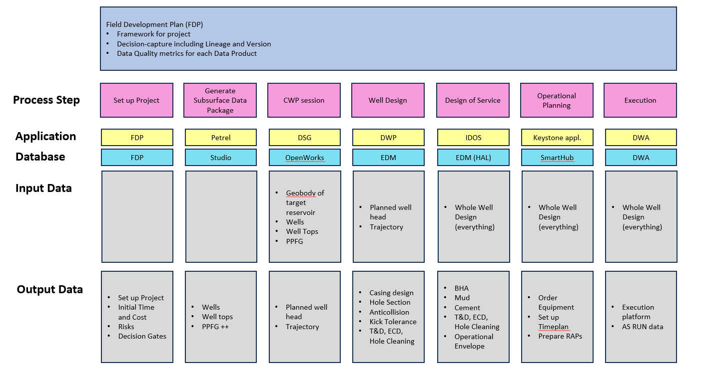

#### Related initiatives

##### Related initiative: WellMate (the Digital Drilling Program)

Contact: Christian Elle (backend)

WellMate is an application developed by InformatiQ to pull information
from other sources to assemble the data needed for a Drilling Program
(including trajectory, casing design, PPFG, etc..). The application
features a “pdf printer” to export the data for conventional deliveries
to authorities and partners.

The project is backed by Yggdrasil asset that have stated that they are
entirely dependent on a smart solution to quickly produce Drilling
Programs (automation). This is because they do not have the manpower to
write all the Programs (55+ ea wells). The delivery date of the solution
is 1st August 2024.

It is important that other subscribers such as InformatiQ, DWOS, DWA,
IDOS are able to “get” the same PPFG package. Hence, the method for
exposing the PPFG data must be considered in this context.

##### Related initiative: Current DWP workflow for importing PPFG (2 ea curves)

Contact: Christian Borsheim

- EDM only has two containers for curves (1 ea for Pore Pressure and 1
  ea for Fracture Gradient). The component “Subsurface Essentials”
  allows importing of new revisions and rewriting of existing revisions.
  The non-active curves are stored in PostGres. You may separate the
  revisions (and hence different curves) by naming convention. Eg
  “Minimum Pore Pressure Rev1”, superseeding “Expected Collapse Pressure
  Rev2.3 From Gunnar_2144124”. This is not a sustainable solution, but
  can be used in the short term.

- EDM does not support curves with ~500+ data points (TVD vs pressure):
  the system crashes. Douglas–Peucker algorithm is applied on import to
  DWP (smoothening the curve).

- We can transfer PPFG and WBS <u>today</u> So, DWP can pick it up and
  have been able to for ages. Pete Heavey will rightly not permit this
  until the data governance (wellbore-PPFG linkage) issue in DWP is
  resolved. Whether the BEST way is to take it from OW is debatable –
  now I believe it should come from Petrel Studio.

Below snapshot from the Import workflow in DWP.

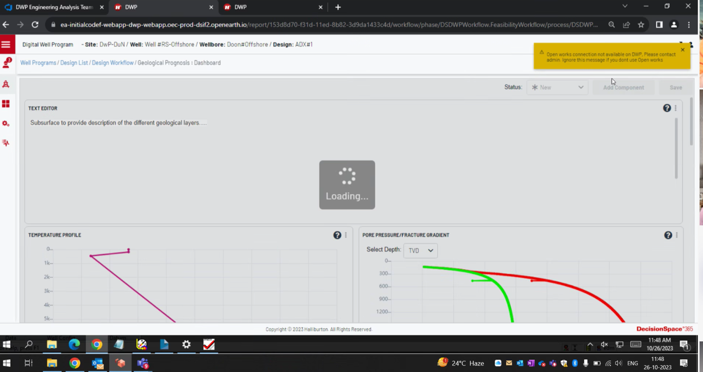

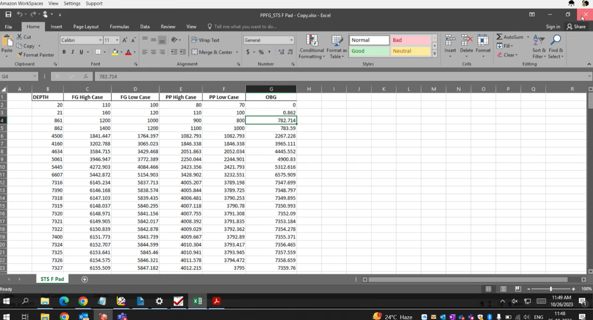

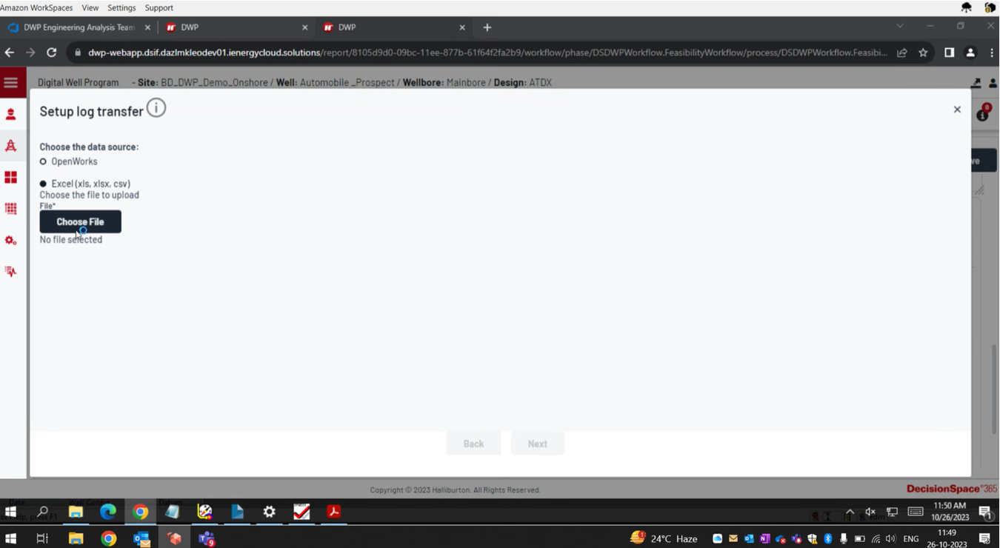

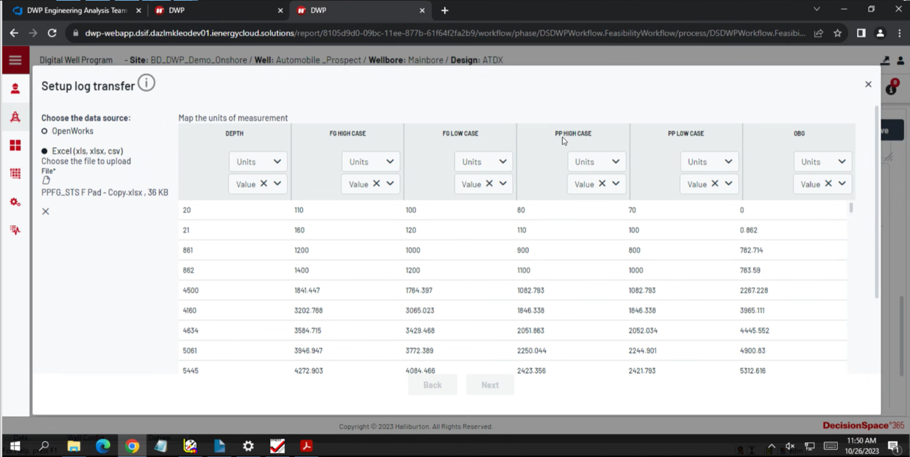

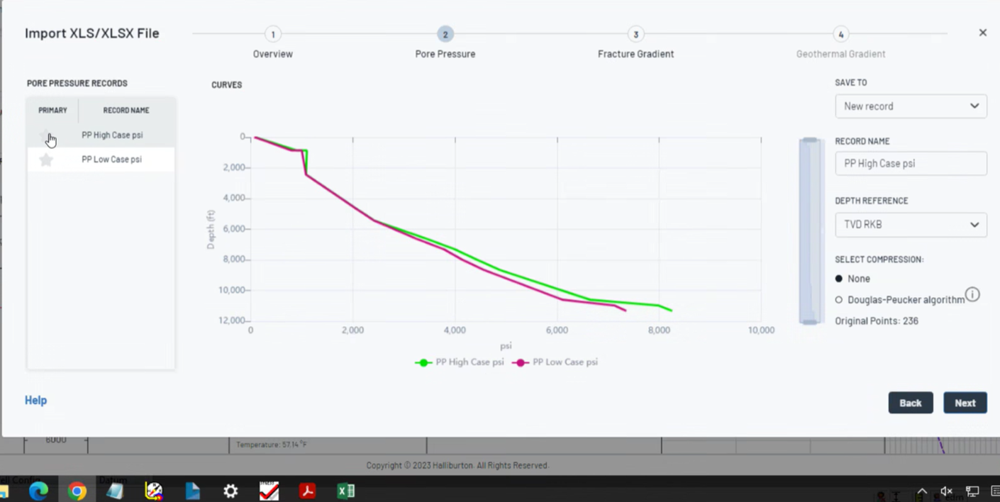

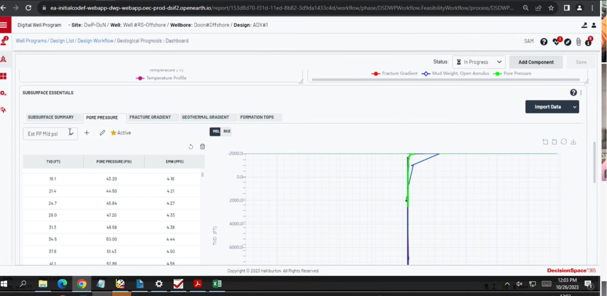

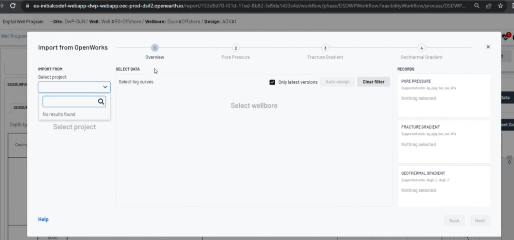

##### Related initiative: DWP expansion of Subsurface Essentials component with more PPFG curves

Contact: Christian Borsheim

Currently (07.07.2024), DWP application is limited to 1 ea Pore Pressure
curve and 1 ea Fracture Gradient curve. This has limitations towards the
well engineering workflows, which ideally would allow for different
combinations of curves to be used from all BMS-required curves (range of
PP, range of FG, range of minimum horizontal stress (shmin), OBG, CG).
Ideally, there would be a logic to extract “the worst case scenario” out
of a set of curves for input into the simulations (an example being a
combined worst case of Pore Pressure and Collapse Gradient as the “lower
pressure limit. For example, the Pore Pressure could be the lowest limit
for the first 2000 mTVD and the Collapse Gradient could be the limit for
the last 1000 mTVD of the well).

In order to address this, the DWP R&D team is working on an expansion of
the Subsurface Essentials component to be deployed in August 2024 which
allows for the manual import of all 11 curves. In the backend, this
means that 9 additional containers are created in PostGres for the
missing curves (this to be verified by DWP PO).

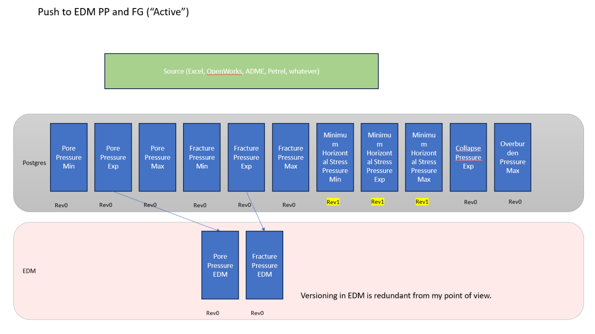

#### Current EDM schemas

1.  Container for WBS, OBG, Shmin (or any range of PP, FG or previously
    mentioned); does not exist.

2.  Container for Faults is the same as Formations.

3.  No container for UCS, Friction angle, PVT data identified yet. PVT
    data is used in BOWK suite.

##### Current EDM schemas: Trajectory

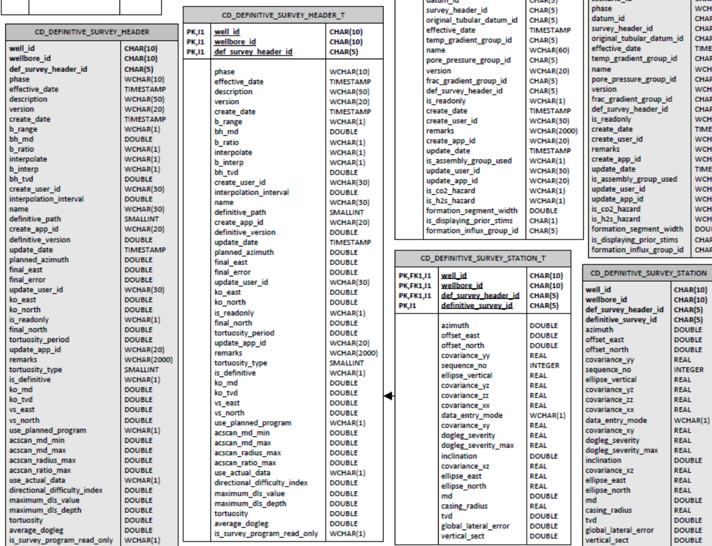

##### Current EDM schemas: PPFG

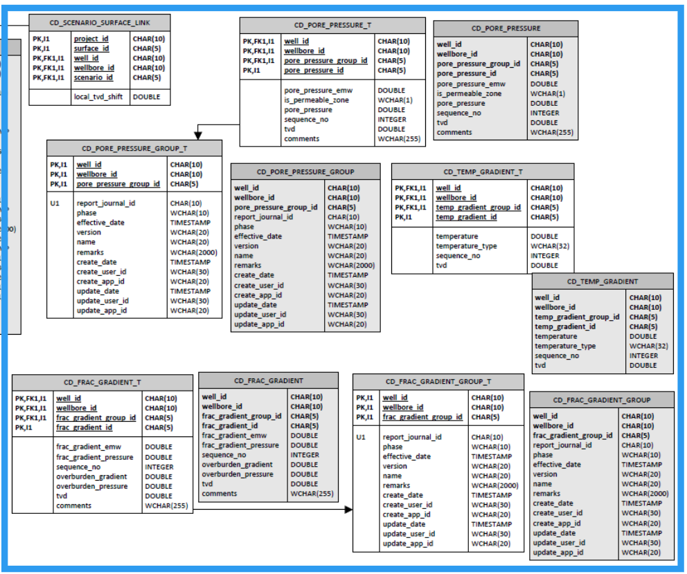

##### Current EDM schemas: Formations

mg src="./images/PPFG-14.png" style="width:4.54167in;height:6.5in" a
a="A screenshot of a computer Description automatically generated" />

#### List of required data

In general, all are repeatable objects unless specified a singular
object.

<table>
<colgroup>
<col style="width: 21%" />
<col style="width: 38%" />
<col style="width: 39%" />
</colgroup>
<thead>
<tr>
<th><strong>“Data Product”</strong> </th>
<th><strong>The data it includes</strong> </th>
<th><strong>Current status</strong> </th>
</tr>
</thead>
<tbody>
<tr>
<td>Metadata</td>
<td><ul>
<li>
Time created
</li>
<li>
Time share
</li>
<li>
Author
</li>
<li>
Last change
</li>
<li>
Last change time
</li>
<li>
Last change author
</li>
<li>
Schema KIND
</li>
<li>
Schema version
</li>
<li>
Schema owner
</li>
<li>
Schema created date
</li>
<li>
Schema last update time
</li>
<li>
Schema last update author
</li>
<li>
Name
</li>
<li>
Description
</li>
</ul></td>
<td>Standard metadata.</td>
</tr>
<tr>
<td>General well info (well name, wellbore) (singular entity)</td>
<td><ul>
<li>
Well ID EDM
</li>
<li>
Wellbore ID EDM
</li>
<li>
Well ID FDP
</li>
<li>
Wellbore ID FDP
</li>
<li>
Well name 
</li>
<li>
Wellbore name 
</li>
</ul></td>
<td>System of Reference is incomplete. We can use EDM ID as “least bad
solution” now.</td>
</tr>
<tr>
<td>Location data (singular entity)</td>
<td><ul>
<li>
Basic well data (location, datum, surface location)
</li>
<li>
Relief well locations
</li>
<li>
Offset Wells
</li>
<li>
CRS
</li>
<li>
Datum
</li>
<li>
UTM
</li>
<li>
Grid/True North
</li>
</ul></td>
<td>
Can come from CWP or manually in COMPASS.

Offset Wells Analyzer potential source for offset wells
listing.
</td>
</tr>
<tr>
<td>Well Trajectory (singular entity)</td>
<td><ul>
<li>
Measured depth 
</li>
<li>
Inclination 
</li>
<li>
Azimuth 
</li>
<li>
True vertical depth 
</li>
<li>
Northing 
</li>
<li>
Easting 
</li>
</ul></td>
<td>Can come from CWP or manually in COMPASS.</td>
</tr>
<tr>
<td>Pressure Profile (singular entity)</td>
<td><ul>
<li>
Datum references
</li>
<li>
Measured depth [m] 
</li>
<li>
True vertical Depth [m] 
</li>
<li>
Fracture Pressure [kg/m^3]  min
</li>
<li>
Fracture Pressure [kg/m^3]  ML
</li>
<li>
Fracture Pressure [kg/m^3]  max
</li>
<li>
Pore Pressure [kg/m^3] min
</li>
<li>
Pore Pressure [kg/m^3] ML
</li>
<li>
Pore Pressure [kg/m^3] max
</li>
<li>
Minimum Horizontal Stress min
</li>
<li>
Minimum Horizontal Stress ML
</li>
<li>
Minimum Horizontal Stress max
</li>
<li>
Collapse Pressure [kg/m^3] 
</li>
<li>
Overburden Gradient
</li>
<li>
References to model_id, author, date etc..
</li>
<li></li>
</ul></td>
<td>Put in manually in DWP (Stresscheck)</td>
</tr>
</tbody>
</table>

#### Proposed schema

Note: PPFGDataset is defined by OSDU as a "Work Product Component". This
means it is a json schema resting on top of conventional files.
Allowable file types for PPFGDataset.1.2.0: WITSML, LAS2, LAS3, csv.

https://community.opengroup.org/osdu/data/data-definitions/-/blob/master/E-R/work-product-component/PPFGDataset.1.2.0.md

- **Attributes**: In general, use OSDU WKS. Attributes will be mTVD
  against pressure for 1 pore pressure and 1 fracture curve at is most
  barebone. At its best, it will include a range of pore and fracture
  gradients, authors, author date, lineage information, datum
  information, legal and access, version, confidence, data quality
  measures, technical maturity, allowable useage areas, etc..

- **data types:** json, csv or reference to source. "data-savy" people
  to decide; not domain experts

- **constraints:** access rights, region, tight groups for exploration
  wells, must be tied to trajectory

- **relationships to other elements:** trajectory and datum (which again
  are related to the rest of the Wellbore hierarchy)

- **relationships to other elements in the data unit (e.g. functional
  dependencies):** dependent on changes and updates to the simulated
  model of the asset and trajectory updates.

- Include maturity information according to "51-001619 PPFG review
  template": Well type, project stage (DG)

- Analysis type and Application: 1D, 2D, 3D, basin, etc.. in Drilworks,
  Petrel, Unix, etc..

- List key offset wells and data types from these offset wells.

- Necessary with Overburden versus Reservoir separations (ref. Valhall)?

- Connection to model_ID

- Need to be specific on WHICH PPFG we want (latest or the one used for
  Well Design)

- -\> OpenWorks creates new IDs when received from Petrel.

- Number of points? Every 1,5,10 meters?

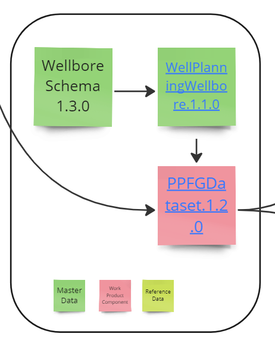
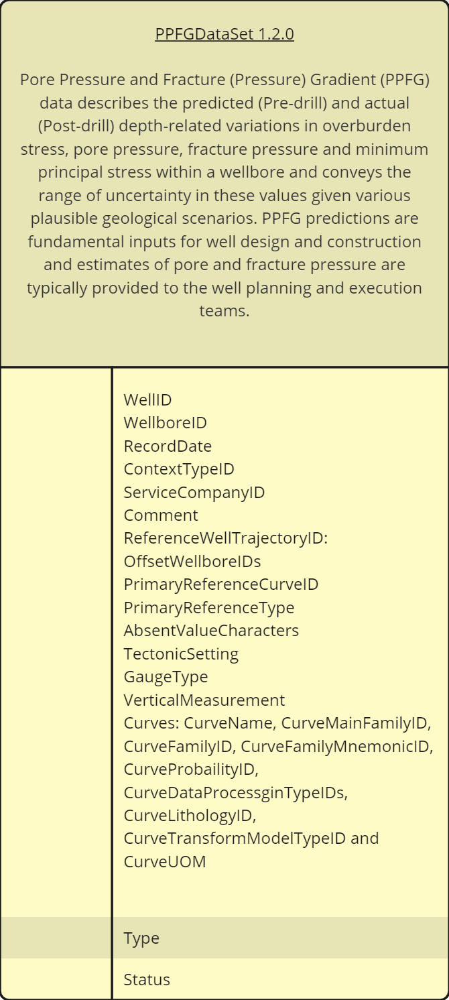

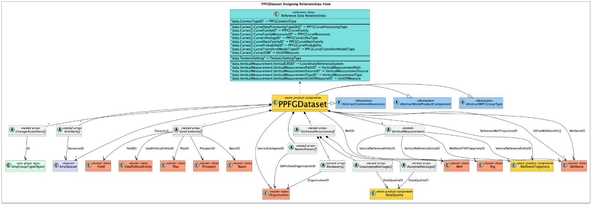

#### Proposed alternatives

There are many roads to Rome. Future DataOps to make a decision on
Cost/Timeline.

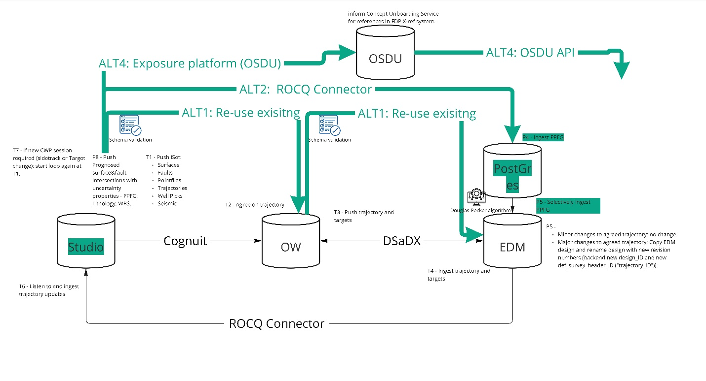

##### Alternative A: Pull from OpenWorks

DWP already has a solution for pulling 1 Pore Pressure and 1 Fracture
Gradient curve from DSG (DecisionSpace Geosciences application by
Halliburton). This functionality was halted due to improper governance:
User could tie any PPFG from any well to the Design they were working
on.

This solution proposes an upgrade to that code to only be able to pull
curves that are consistent with the Design_ID that the engineer is
currently working on. In order to do this, we need amongst others, the
trajectory_ID (can be represented by EDM def_survey_header_ID) to be
present on the curves as metadata.

It is likely that it is possible to expand such a solution (OW pull to
DWP) to other initiatives? OW curves are available through DSIS. Coupled
with the same limitations to the OW query (design-locked); this should
be feasible.

There is an argument to move PPFG not only from Petrel to EDM directly,
but also to OW. “We would like to be able to use this data, especially
the collapse data, but other properties in 2d and 3d such as UCS in CWP.
Primarily for multidisciplinary visualisation. Barriers to doing this
have been software instability in DSG for the last months, and
unavailability of the Petrel PPFG/RM models.”

**PPFG should be considered in context of the CWP session. It makes
sense for the author (Henrik Næsgaard) to define a loop for trajectory
and then tie all Data products to the same loop. In other words, when
there is a change in the trajectory, Petrel Studio publishes a new set
of PPFG, OBG, CG, Shmin, UCS, FA, Picks formations, Picks faults.**

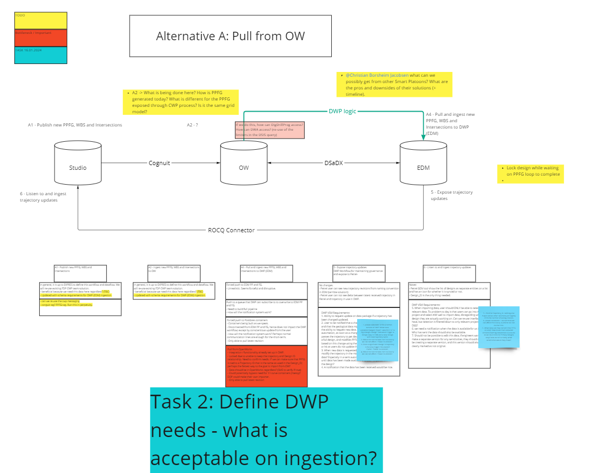

##### Alternative B: Reverse-Engineer ROCQ Connector

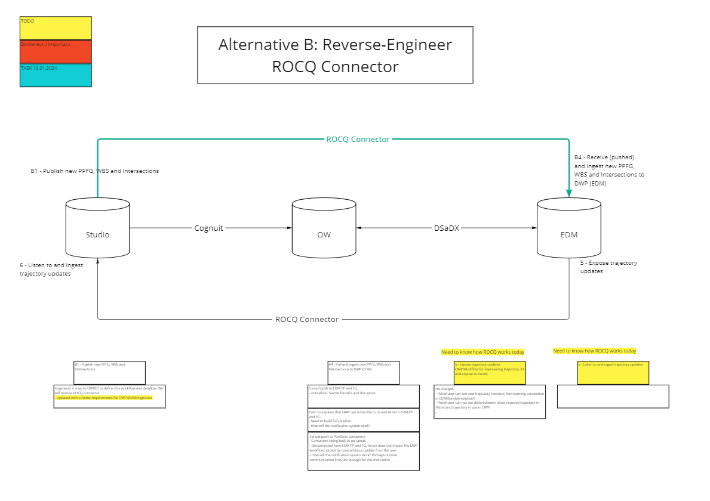

##### Alternative C: Whole new solution (example Backbone or ADME)

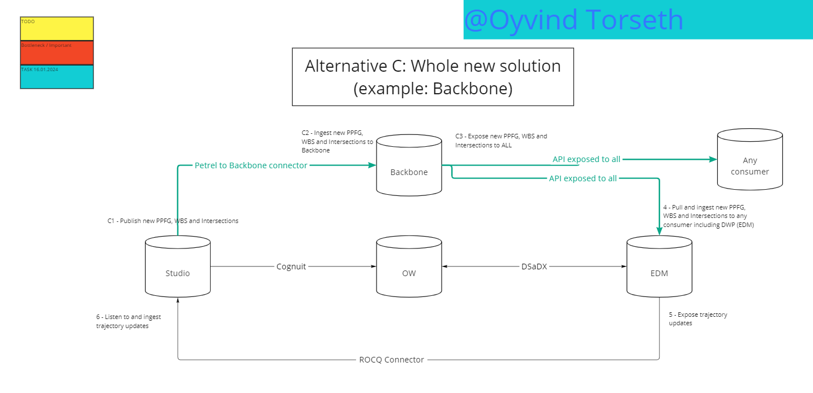

##### Alternative D: Data Product version

By Data Product Support Team.

**<u>AS-IS data architecture</u>**

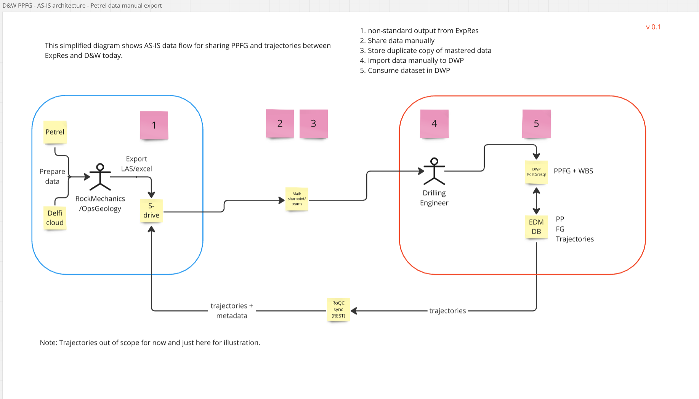

- For a more detailed description, miro board from ‘walkthrough 23 Sep’.
  By Albert Kingma.

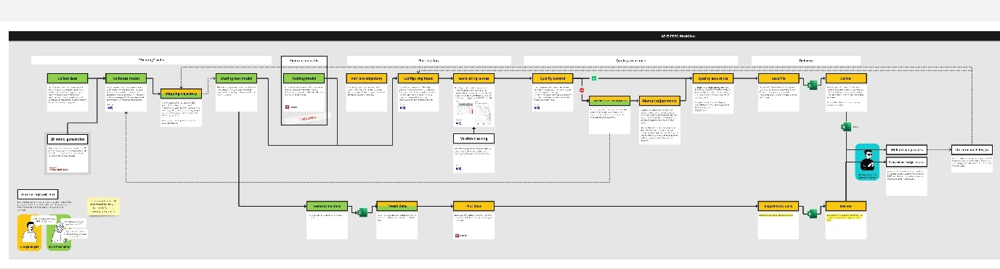

**<u>TRANSITION</u>** **<u>data architecture</u>** **<u>(MVP)</u>**

Proposed MVP described below. Use case: Christian Borsheim; Transfer
PPFG data from Petrel to DWP.

The solution is broken down into 5 elements:

1.  Standard output from Delfi/Petrel.

2.  Extract data

3.  Transform data to OSDU compliant format

4.  Store data

5.  Consume data in DWP

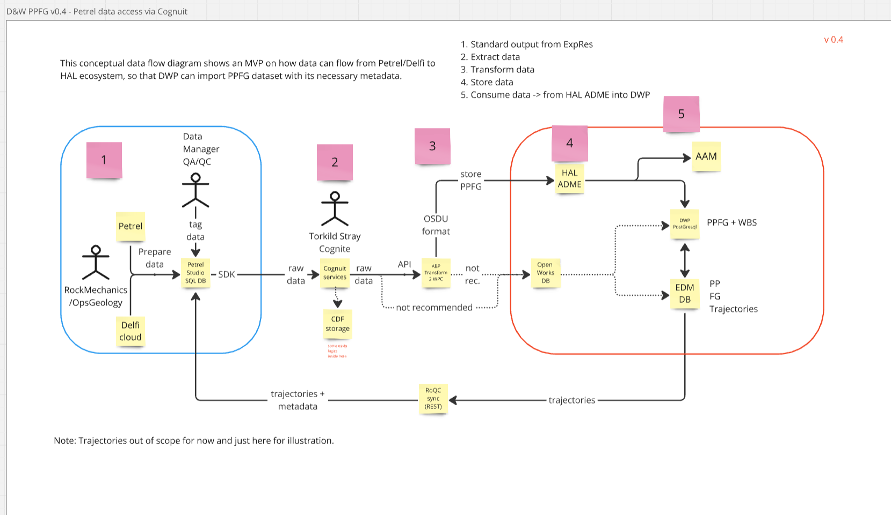

Hi-level description of solution. **Bold** means short term solution.

1.  Expose PPFG data from Petrel to Petrel Studio

    1.  No excel sheet to be exported.

    2.  Prepare and QA/QC data from Petrel in a **standardized format**.
        Rock Mechanics & Geology Ops.

    3.  Provide a standard format/schema with naming convention -\>
        PeteH, Samad, Robert Maclean

    4.  QA/QC by Data Manager (tag the data for exposure) -\> Robert
        Maclean.

    5.  Also need to test data from Delfi.

2.  Extract PPFG data from Petrel Studio

    1.  Testing with Cognuite API to extract data

    2.  Alternatives: 1) **via Cognuite API** **(short term)** 2) via
        SLB SDK (long long term) 3) via S-drive (not recommended) 4)
        others

3.  Do necessary transformations

    1.  Guided by OSDU, map data into Well Known Schema.

    2.  Alternatives: 1) Cognuit (not recommended), 2) HAL
        (investigate) 3) **ABP azure** **pipeline** **via python
        notebook** 4) via Nitro platform.

4.  Publish and Share data in a data hub

    1.  Preferable HAL OSDU instance. Make design choices to maximize
        OSDU adaptation.

    2.  Alternatives: **1) Direct with HAL ADME api’s.** **OR** **2)**
        **via ABP APIM**

5.  DWP to consume PPFG data

    1.  Alternatives **1)** **DWP read from HAL ADME**. 2) DWP read from
        APIM. 3) DWP to manually import excel sheet.

**<u>TO-BE data architecture</u>**

The below diagram is used for discussions. Some strategic decisions need
to be made.

- See FutureOps miro board for original diagram.

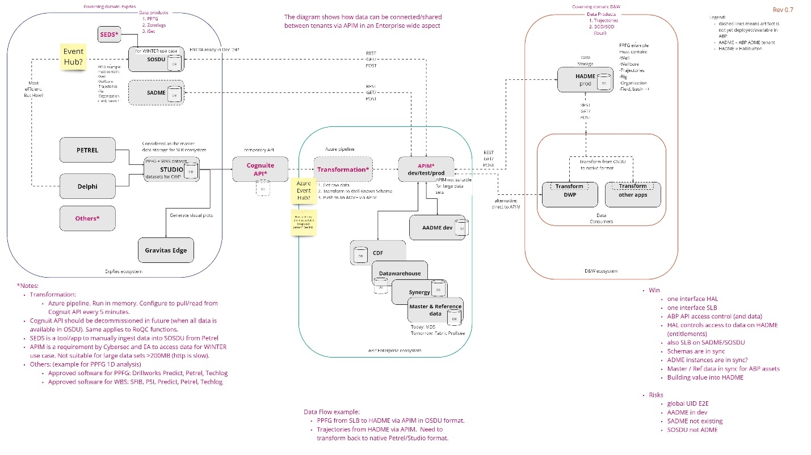

Discussion:

- Diagram show a possible data architecture with 3 ADME instances.

- The idea is to visualise how to share data between tenants via APIM
  APIs.

  - Concern: how do we keep data in sync if it is duplicated in the
    tenants?

- The data products are placed according to ‘governing tenant’

- Investigate a version without APIM, that has direct access to HADME
  api’s.

- Investigate the role of Gravitas Edge, used to visualised PPFG curves
  for ExpRes. How is data exported into Gravitas?

- Data architecture: should investigate which pattern to use. Is Event
  Hub an option? Also see this guideline page and questions.

- Is PPFG excel version exported in LAS format? It seems so.

##### Alternative E: Grant’s perspective

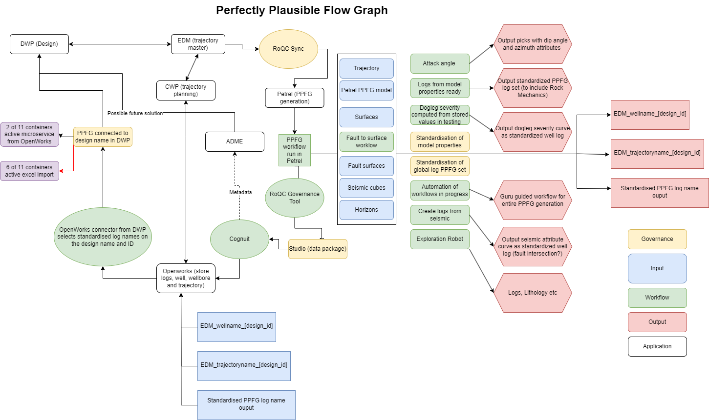

This diagram is from Grant and describes the larger picture. For PPFG
dataset, the data flow can be;

1.  Petrel generates PPFG curves.

2.  PPFG workflow is run in Petrel.

3.  RoQC Governance Tool ensure that the naming standards are compliant.

4.  The data is pushed into Studio (manually?).

5.  Cognuit pulls data once it is tagged ‘approved’ by a Data Manager.

6.  Then Cognuit can push data into OpenWorks DB, , which again push
    data to the ‘master’ EDM DB, but since EDM can only store 2 PPFG
    curves (of 11 or more), a way around is to store a full dataset in
    DWP’s PostgreSQL DB. This may be great for DWP, but solution must be
    able to scale into other consumers too. The goal is to store in an
    ADME instance. It really should store the PPFG data in SLB’s ADME,
    as they are the owner of the data set, then Hal pulls data from this
    tenant (the future Microsoft Mesh). Do we have any interim solution
    today? (APIM?)

Discussion with KjetilØ:

- Should get as close to source as possible. Export directly from petrel
  /governance plugin to xADME?

- Need to ensure xADME contains sufficient rec data such as wellbore etc
  (dependencies).
